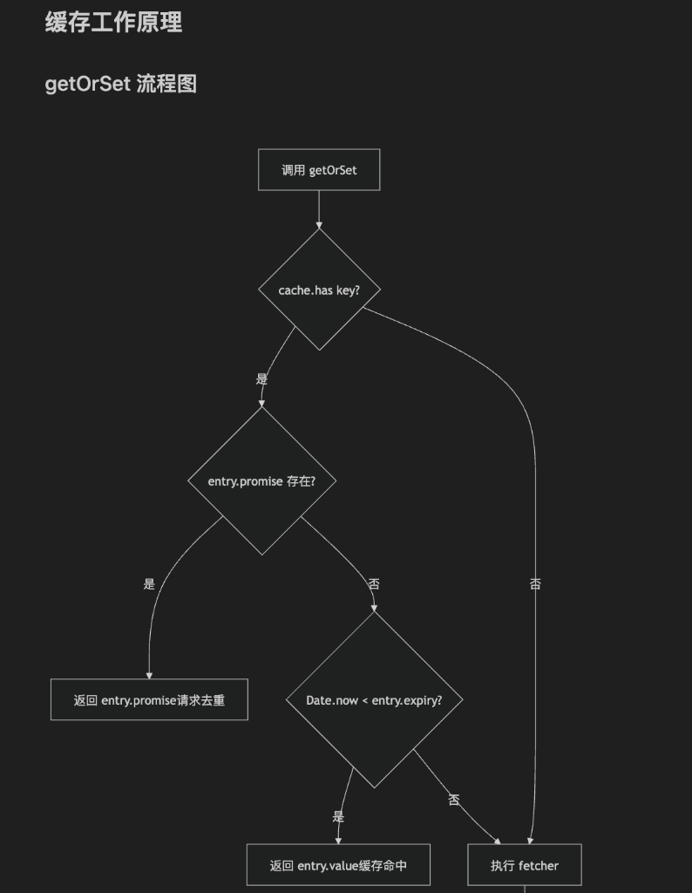
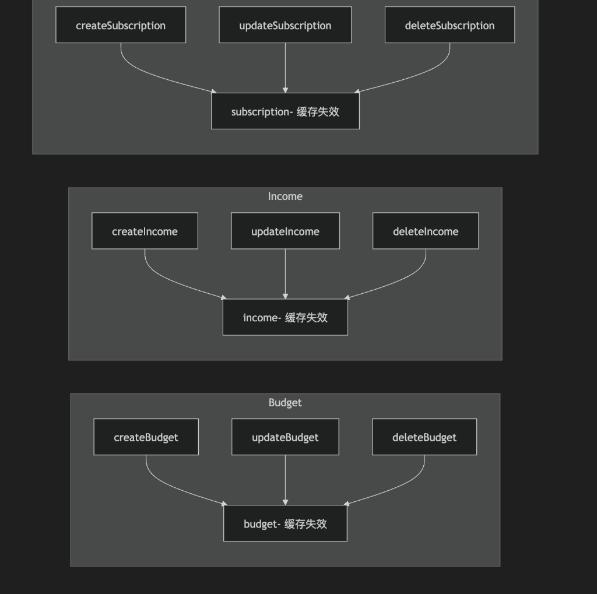

# Cache Architecture 详解

本文档详细介绍了前端缓存架构的设计原则、实现细节和最佳实践。

## 目录

1. [设计目标](#设计目标)
2. [核心组件](#核心组件)
3. [缓存工作原理](#缓存工作原理)
4. [缓存 Key 设计](#缓存-key-设计)
5. [缓存失效策略](#缓存失效策略)
6. [数据流图](#数据流图)
7. [防抖机制](#防抖机制)
8. [最佳实践](#最佳实践)
9. [测试](#测试)

---

## 设计目标

| 目标 | 实现方式 |
|------|----------|
| **减少网络请求** | 使用内存缓存存储 API 响应 |
| **请求去重** | 相同 key 的并发请求共享同一 Promise |
| **数据一致性** | CUD 操作后自动失效相关缓存 |
| **多用户安全** | Cache key 包含 userId 防止数据泄露 |
| **快速首屏加载** | 首次渲染无延迟，仅后续变化防抖 |

---

## 核心组件

### 1. simpleCache (内存缓存)

**文件位置**: `apps/frontend/src/utils/simpleCache.js`

```
┌─────────────────────────────────────────────────────────────┐
│  simpleCache                                                │
├─────────────────────────────────────────────────────────────┤
│  cache = Map<string, CacheEntry>                            │
│                                                             │
│  CacheEntry = {                                             │
│    value?: any,        // 缓存的数据                        │
│    expiry?: number,    // 过期时间戳                        │
│    promise?: Promise   // 进行中的请求 (用于去重)           │
│  }                                                          │
├─────────────────────────────────────────────────────────────┤
│  API:                                                       │
│  • getOrSet(key, fetcher, signal?, ttl?)  // 获取或设置缓存 │
│  • delete(key)                             // 删除指定 key  │
│  • invalidateByPrefix(prefix)              // 按前缀批量删除│
│  • clear()                                 // 清空所有缓存  │
│  • size()                                  // 获取缓存条数  │
└─────────────────────────────────────────────────────────────┘
```

### 2. useDebouncedValue (防抖 Hook)

**文件位置**: `apps/frontend/src/hooks/useDebouncedValue.js`

```javascript
function useDebouncedValue(value, delay = 500) {
  // 首次渲染: 立即返回 value (无延迟)
  // 后续变化: 防抖 delay 毫秒后更新
}
```

---

## 缓存工作原理

### getOrSet 流程图



**流程说明:**

```
调用 getOrSet(key, fetcher)
         │
         ▼
   ┌─────────────┐
   │cache.has(key)?│
   └─────────────┘
         │
    ┌────┴────┐
    是        否
    │         │
    ▼         │
┌─────────┐   │
│promise  │   │
│存在?    │   │
└─────────┘   │
    │         │
  ┌─┴──┐      │
  是   否     │
  │    │      │
  ▼    ▼      │
返回   检查    │
promise expiry │
(去重)  │      │
        │      │
   ┌────┴────┐ │
   未过期  过期 │
   │       │   │
   ▼       ▼   ▼
 返回    执行 fetcher
 value   ─────────────┐
                      │
                      ▼
               cache.set(key, promise)
                      │
                      ▼
              ┌───────────────┐
              │  请求成功?     │
              └───────────────┘
                   │
              ┌────┴────┐
              是        否
              │         │
              ▼         ▼
         signal已    cache.delete(key)
         abort?      抛出 error
              │
         ┌────┴────┐
         是        否
         │         │
         ▼         ▼
    cache.delete  cache.set(key,
         │        value + expiry)
         │              │
         └──────┬───────┘
                ▼
           返回 value
```

### 核心代码解析

```javascript
async getOrSet(key, fetcher, signal, ttl = 60000) {
    const cached = cache.get(key)
    
    // 1. 检查缓存
    if (cached) {
        // 如果有进行中的请求，返回同一个 Promise (请求去重)
        if (cached.promise) return cached.promise
        
        // 如果未过期，返回缓存值
        if (Date.now() < cached.expiry) return cached.value
        
        // 已过期，删除旧条目
        cache.delete(key)
    }
    
    // 2. 执行 fetcher 并缓存 Promise
    const promise = fetcher()
        .then((value) => {
            // 请求成功，只有在未被取消时才缓存
            if (!signal?.aborted) {
                cache.set(key, { value, expiry: Date.now() + ttl })
            }
            return value
        })
        .catch((error) => {
            // 请求失败，删除条目以允许重试
            cache.delete(key)
            throw error
        })
    
    // 3. 立即缓存 Promise 以实现请求去重
    cache.set(key, { promise })
    return promise
}
```

---

## 缓存 Key 设计

### 命名规范

```
{module}-{operation}-{userId}-{params...}
```

### 各服务的 Cache Key

| 服务 | Key 模式 | 示例 |
|------|----------|------|
| Budget | `budget-summary-{userId}-{month}-{year}` | `budget-summary-abc123-1-2026` |
| Income | `income-summary-{month}-{year}` | `income-summary-1-2026` |
| Subscription | `subscription-total-{userId}` | `subscription-total-abc123` |
| Expense | `expense-list-{userId}-{month}-{year}` | `expense-list-abc123-1-2026` |

### 为什么 userId 很重要

```
❌ 错误示例 (不含 userId):
   cache.set("budget-summary-1-2026", user1_data)
   
   → User2 登录后访问同一月份
   → 返回 User1 的数据！(安全漏洞)

✅ 正确示例 (含 userId):
   cache.set("budget-summary-user1-1-2026", user1_data)
   cache.set("budget-summary-user2-1-2026", user2_data)
   
   → 每个用户有独立的缓存条目
```

---

## 缓存失效策略

### 1. 时间失效 (TTL)

默认 60 秒后自动过期，下次访问时重新获取最新数据。

### 2. 主动失效 (Prefix-based Invalidation)

```javascript
// ❌ 旧方式: 清空所有缓存
simpleCache.clear()  // 删除所有服务的所有缓存

// ✅ 新方式: 按前缀精准失效
simpleCache.invalidateByPrefix('budget-')  // 只删除预算相关缓存
```

### 3. 各服务的失效规则



**失效规则表:**

| 操作 | 失效的缓存前缀 |
|------|---------------|
| createExpense / updateExpense / deleteExpense | `expense-` 和 `budget-` |
| createBudget / updateBudget / deleteBudget | `budget-` |
| createIncome / updateIncome / deleteIncome | `income-` |
| createSubscription / updateSubscription / deleteSubscription | `subscription-` |

> **注意**: Expense 的 CUD 操作会同时失效 `expense-` 和 `budget-` 缓存，因为费用会影响预算摘要。

---

## 数据流图

### 完整请求流程

```
用户访问 Dashboard
     │
     ▼
┌─────────────────────────────────────────────────────────────────┐
│ Dashboard 组件                                                  │
│   const [month, setMonth] = useState(1)                         │
│   const debouncedMonth = useDebouncedValue(month, 500)          │
│                          │                                      │
│                          ▼                                      │
│                   立即返回 month=1 (首次渲染无延迟)              │
└─────────────────────────────────────────────────────────────────┘
     │
     ▼
┌─────────────────────────────────────────────────────────────────┐
│ useEffect(() => fetchData(), [debouncedMonth])                  │
└─────────────────────────────────────────────────────────────────┘
     │
     ▼
┌─────────────────────────────────────────────────────────────────┐
│ budgetService.getBudgetSummary({month:1, userId})               │
└─────────────────────────────────────────────────────────────────┘
     │
     ▼
┌─────────────────────────────────────────────────────────────────┐
│ simpleCache.getOrSet("budget-summary-user1-1-2026", fetcher)    │
│                          │                                      │
│                   检查缓存 → 未命中                              │
│                          │                                      │
│                          ▼                                      │
│                   执行 API 请求                                  │
│                          │                                      │
│                          ▼                                      │
│                   存储结果 (TTL=60s)                             │
└─────────────────────────────────────────────────────────────────┘
     │
     ▼
显示数据给用户
```

### 用户快速切换月份场景

```
用户输入: 1 ──[100ms]── 2 ──[100ms]── 3 ──[100ms]── 4
                                                     │
          useDebouncedValue 保持返回 1               │
                                                     │
                                           ┌─────────┘
                                           │ 500ms 后
                                           ▼
                                    返回 4 (跳过 2, 3)
                                           │
                                           ▼
                              只触发一次 API 请求 (month=4)
```

---

## 防抖机制

### 为什么需要 useDebouncedValue?

**问题**: 用户快速切换月份 (1→2→3→4) 会触发 4 次 API 请求

**解决方案**:

```
输入:     1 ──[100ms]── 2 ──[100ms]── 3 ──[100ms]── 4
                                                    │
                                                    ▼ 500ms后
API请求:                                            4 (只请求一次)
```

### Hook 特性

| 场景 | 行为 |
|------|------|
| 首次渲染 | **立即返回** 初始值，无延迟 |
| 值变化 | **500ms 防抖** 后更新 |
| 快速连续变化 | **只保留最后一个值** |
| 组件卸载 | **清理计时器**，防止内存泄漏 |

### 使用示例

```javascript
function Dashboard() {
  const [month, setMonth] = useState(1)
  const debouncedMonth = useDebouncedValue(month, 500)
  
  useEffect(() => {
    // 只在 debouncedMonth 变化时触发请求
    fetchData(debouncedMonth)
  }, [debouncedMonth])
}
```

---

## 最佳实践

### 1. 选择正确的缓存范围

```javascript
// ✅ 缓存聚合/摘要数据
getBudgetSummary()  // 用户不太可能频繁修改

// ⚠️ 谨慎缓存列表数据
listExpenses()      // 如果需要实时性，考虑更短的 TTL

// ❌ 不缓存频繁变化的数据
getNotifications()  // 需要实时更新
```

### 2. 设计正确的 Cache Key

```javascript
// ✅ 好的 key 设计
`budget-summary-${userId}-${month}-${year}`

// ❌ 坏的 key 设计
`budget-${month}`  // 缺少 userId，会导致用户数据混淆
```

### 3. 正确的失效时机

```javascript
// ✅ CUD 操作后立即失效
async function createBudget(data) {
    const result = await api.post('/budgets', data)
    simpleCache.invalidateByPrefix('budget-')  // 立即失效
    return result
}

// ❌ 不失效可能导致数据不一致
async function createBudget(data) {
    return api.post('/budgets', data)
    // 用户回到 Dashboard 看到的还是旧数据!
}
```

### 4. 处理跨模块依赖

```javascript
// Expense 影响 Budget 摘要
async function createExpense(data) {
    const result = await api.post('/expenses', data)
    simpleCache.invalidateByPrefix('expense-')
    simpleCache.invalidateByPrefix('budget-')  // 费用影响预算!
    return result
}
```

---

## 测试

### 测试目录结构

```
apps/frontend/src/
├── __tests__/                         # 测试目录
│   ├── setup.js                       # 测试配置
│   ├── utils/
│   │   └── simpleCache.test.js        # 14 tests
│   ├── hooks/
│   │   └── useDebouncedValue.test.js  # 13 tests
│   └── services/
│       ├── budgetService.test.js      # 10 tests
│       ├── incomeService.test.js      # 10 tests
│       ├── subscriptionService.test.js # 12 tests
│       └── expenseService.test.js     # 13 tests
```

### 运行测试

```bash
cd apps/frontend

# 运行所有测试
npm run test:run

# 监视模式
npm run test
```

### 测试覆盖范围

| 测试文件 | 测试数 | 覆盖内容 |
|----------|--------|----------|
| **simpleCache.test.js** | 14 | TTL、请求去重、abort 处理、前缀失效、多用户隔离 |
| **useDebouncedValue.test.js** | 13 | 首次立即返回、防抖行为、清理、边界情况 |
| **budgetService.test.js** | 10 | 带 userId 的缓存 key、CUD 失效 |
| **incomeService.test.js** | 10 | Summary 缓存、失效隔离 |
| **subscriptionService.test.js** | 12 | Total 缓存、所有变更类型 |
| **expenseService.test.js** | 13 | List 缓存、跨服务失效 |

**总计: 72 个测试 ✅**
